# Development Report For INFO2222 Project:Usability
## Step1: User Investigation/PACT ANALYSIS 
To conduct the PACT (People, Activities, Contexts, Technologies) analysis, a Google Form as (https://docs.google.com/forms/u/0/d/e/1FAIpQLScA91j1xsRzqu1iCsfSLHOXerUZcJicqLlEjfBDLPCdfW7DTg/formResponse) was created and distributed among the target user group, which consists of students. The form contained questions about the respondents' social media usage habits, preferences, and desired features. The responses were collected and analyzed to identify patterns and trends, which were then used to create the following report.

Apart from the google survey, we investigate past paper and research to understand the user's needs and preferences. 
We also create a persona to represent the target user group and provide a detailed analysis of the findings.

### People
- **User Group**: Students, including those just starting their program of studies, final year students, and students transferring into a computing program from other schools.
- **Characteristics**:
  - **Age Range**: 18-25 years old.
  - **Role**: All respondents are students.
  - **Social Media Usage**: Most use Discord, with some using Instagram.
  - **Average Daily Social Media Usage Time**: Primarily between 2-4 hours and 4-6 hours.
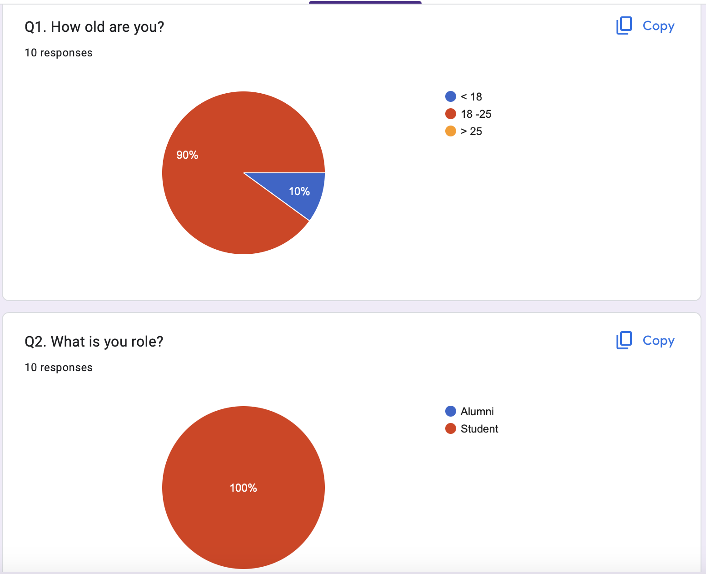

### Activities
- **Online Activities**:
  - Using social media to interact with friends and classmates, sharing information and resources.
  - Valuing positive features such as interface design, functionality, and security.
  - Enjoying features like anonymous posting, categorizing posts, and thread filtering.
- **Time Allocation**:
  - Daily social media usage mainly falls between 2-6 hours, probably in late afternoon or evening.
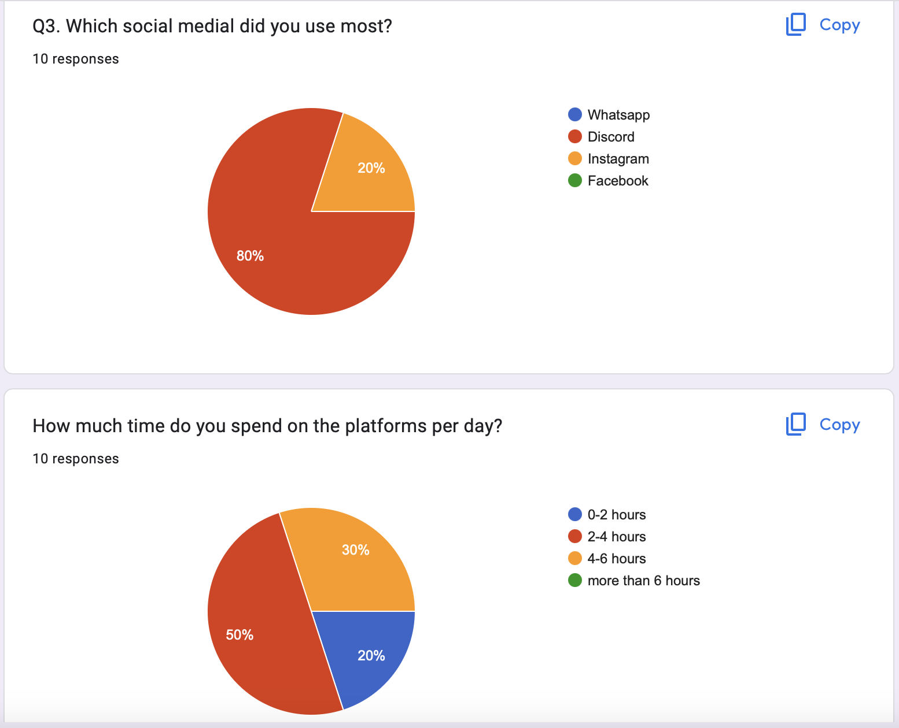

### Contexts
- **Usage Context**:
  - Students likely use social media during study breaks or after classes to connect with friends and classmates.
- **Goals**:
  - Seeking academic support, social interaction, and sharing and obtaining information.

### Technologies
- **Devices Used**:
  - Primarily smartphones and personal computers.
  - Requires a stable internet connection.
- **Desired Features**: (in order of priority)
  - Ability to withdraw or modify posts.
  - Separate posts by category.
  - Anonymous posting.
  - Dark mode option.
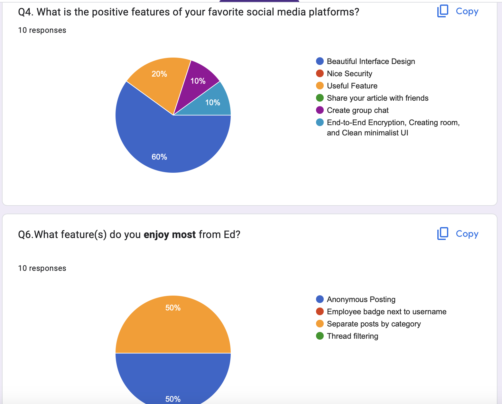
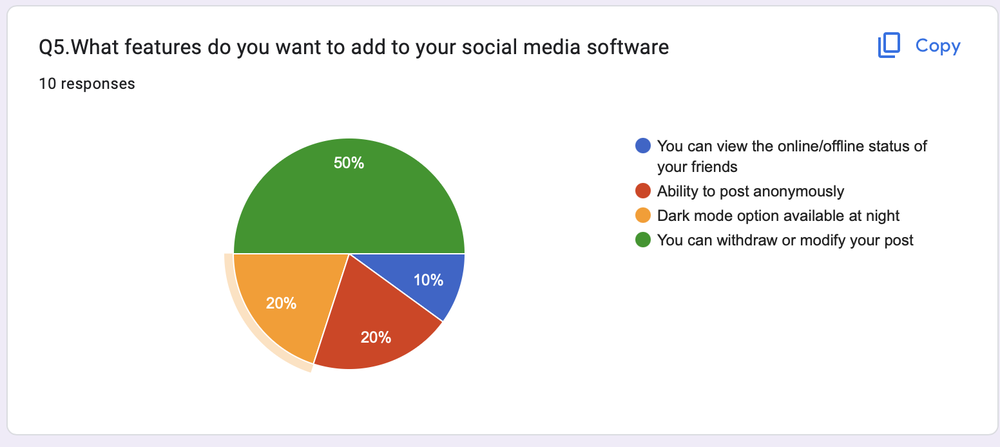

### Past Paper and Research
Social media users are predominantly young people with basic technology skills, commonly using devices such as smartphones and laptops (King, 2021). For this demographic, design is highly important; they place significant value on the app's aesthetics, compatibility across devices, and robust security features. Ensuring that the social media platform is visually appealing, user-friendly, and secure can greatly enhance their experience and satisfaction (Moshagen & Thielsch, 2010).

#### Persona: Dedicated Computer Science Student

#### Name
Alex Johnson

#### Current Role
Bachelor of Advanced Computing student

#### Demographics
- **Age**: 21
- **Education**: Undergraduate student in Advanced Computing
- **Background**: High school diploma with strong focus on mathematics and computer science
- **Area of Interest**: Software development, artificial intelligence, and data science

#### Goals and Tasks
- **Motivation**: To gain in-depth knowledge and practical experience in cutting-edge computing technologies
- **Tasks**:
  - Discuss lectures and assignments
  - Participate in coding competitions
  - Seek internships and networking opportunities

#### Environment
- **Tech Savvy**: Highly tech-savvy
- **Devices**: Laptop (high-performance), smartphone, access to university computer labs and libraries

#### Quote
"I am passionate about solving real-world problems with technology and am constantly looking for new challenges to improve my skills."

### Investigation Findings and Recommendations
Based on the analysis, we can draw the following conclusions and recommendations:

1. **Clear Target User Group**: All respondents are students aged 18-25, mainly using Discord and Instagram, with daily social media usage between 2-6 hours.
2. **Specific Feature Needs**: Users want additional features such as post withdrawal or modification, anonymous posting and dark mode.
3. **Design Suggestions**: When designing a new social media platform or improving an existing one, focus on aesthetic interface, practical functionality, security, and user privacy protection. Additionally, consider adding the desired features to enhance user experience.

## Step 2: Navigation design

### Card Sorting
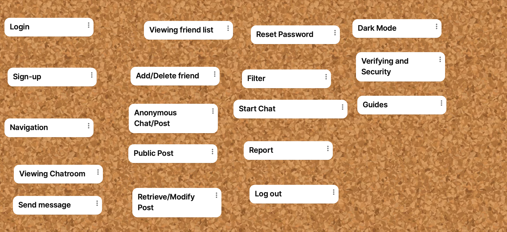
To better understand the preferences and needs of our users for the web chat application, we conducted a card sorting activity with a group from the INFO2222 community. In this activity, we provided participants with basic elements, including various functionalities and interface components such as login, sign-up, navigation, viewing chatrooms, sending messages, dark mode, and more. The participants were encouraged to create their own tags and add new elements to categorize these items, allowing for a more flexible and user-driven organization.

The result is as follows:
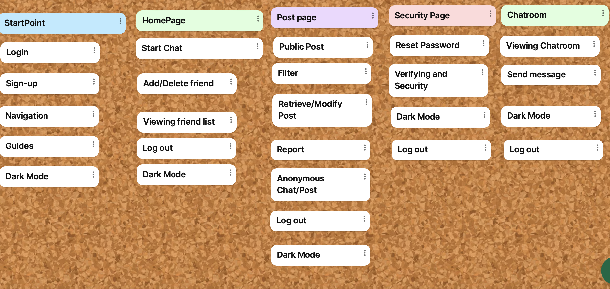   

### Site Map design

The card sorting activity revealed that the participants divide functionalities into five main group as:

#### StartPoint

Elements: Login, Sign-up, Navigation, Guides, Dark Mode

Analysis: Participants identified basic entry points and general navigation elements as part of the initial interaction with the application. This highlights the importance of having a user-friendly and accessible starting interface.
#### HomePage

Elements: Start Chat, Add/Delete Friend, Viewing Friend List, Log out, Dark Mode

Analysis: The homepage is seen as a central hub where users can quickly access primary functionalities like starting a chat, managing friends, and viewing the friend list. The inclusion of “Dark Mode” in multiple categories suggests its high importance across different sections.
#### Post Page

Elements: Public Post, Filter, Retrieve/Modify Post, Report, Anonymous Chat/Post, Log out, Dark Mode

Analysis: The post page is recognized for its focus on content management and user interactions. Features such as public posting, filtering, and modifying posts are crucial for this section, indicating that users value flexibility and control over their content.
#### Security Page

Elements: Reset Password, Verifying and Security, Dark Mode, Log out

Analysis: Security is a significant concern for users, with emphasis on functionalities related to password management and security verification. 

#### Chatroom

Elements: Viewing Chatroom, Send Message, Dark Mode, Log out

Analysis: The chatroom is a dedicated space for real-time communication, with a focus on viewing and sending messages. Consistency in including “Dark Mode” and “Log out” indicates that these features are seen as essential across the application.

Based on these investigations, we develop a basic structure as the site map here.
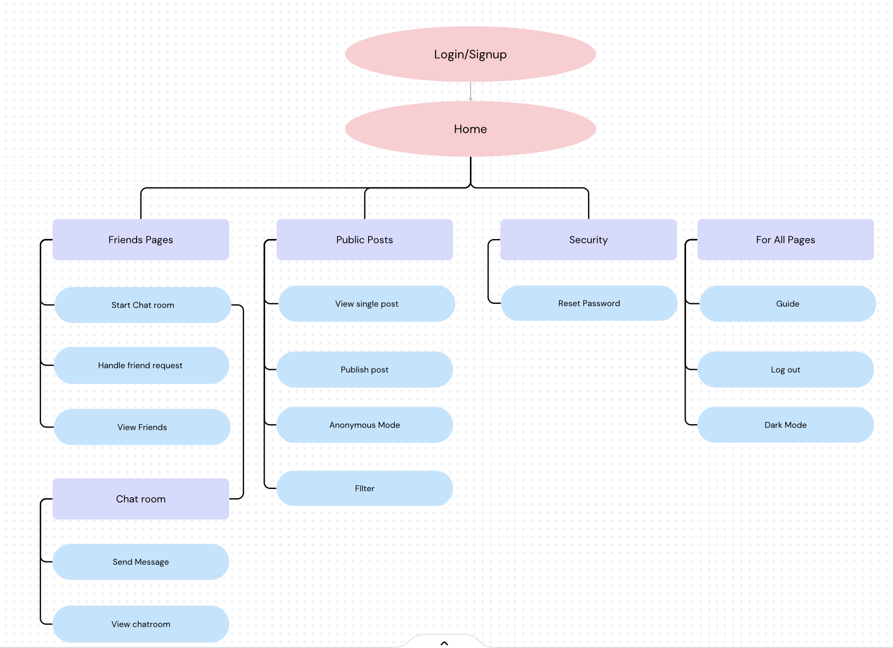  
The web-app will involve a multi-layered architecture designed to provide a seamless and secure user experience, structured according to the site map. At the top level, the Login/Signup page serves as the entry point, ensuring that only authenticated users can access the application.

Home Page
Once authenticated, users land on the Home page, which acts as the central hub for navigation. From here, users can access various sections of the application:

Friends Pages
Start Chat Room: Allows users to initiate new chat rooms.
Handle Friend Request: Manages incoming and outgoing friend requests.
View Friends: Displays a list of friends.
Chat Room: Contains sub-pages for viewing chat rooms and sending messages.
Public Posts
View Single Post: Enables users to view individual posts.
Publish Post: Allows users to create and publish new posts.
Anonymous Mode: Offers an option to post anonymously.
Filter: Provides functionality to filter posts based on various criteria.
Security
Reset Password: Allows users to reset their passwords, enhancing account security.
For All Pages
Guide: Provides user guides and documentation.
Log Out: Enables users to securely log out of the application.
Dark Mode: Offers a toggle option for dark mode, enhancing the user interface experience.

### Step 3: Design-Evaluate
#### Feature Prioritization
Based on the feedback , we have compiled the following prioritized list of features. These features are intended to improve the overall user experience and usability of the ChatConnect application:

Dark Mode
Anonymous Posting
Modify and Retrieve Posts

While not all features may be developed within the scope of this project, this list serves as a 'wish list' for future enhancements.

#### Design Principles
Steps to Determine the Best Design

Brainstorming and Sketching: Our team began by brainstorming potential layouts and features. We sketched various designs for key interfaces such as the chat window and post page.
Prototype Creation: Based on our sketches, we created low-fidelity digital prototypes using Figma. These prototypes focused on layout and functionality without detailed design elements.
Guerrilla Testing: We conducted guerrilla testing with target users, including both team members and one participant outside our team. Each team member facilitated a test session to gather diverse feedback.
Feedback Analysis: We analyzed the feedback to identify common usability issues and preferences. 

#### Wireframe
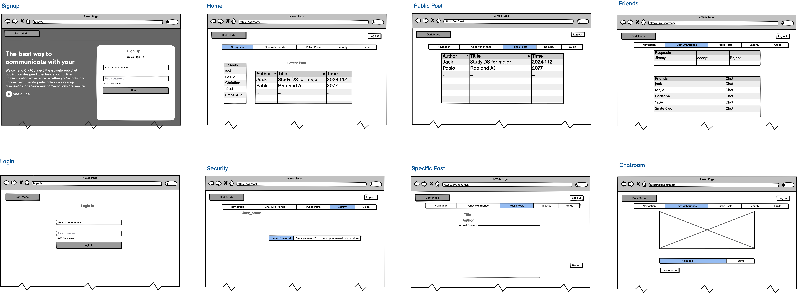
We created a wireframe to visualize the layout and structure of the ChatConnect application. The wireframe includes key elements such as the chat window, post page, and navigation bar. This visual representation helps us understand the overall flow and interaction within the application.

#### Guerrilla Testing
We conducted guerrilla testing with target users to gather feedback on the wireframe prototype. The testing sessions involved offering the wireframe and site map to participants and asking them to answer questions on how to navigate the application (https://docs.google.com/forms/d/1fqeB0CirUTQG9yBnO1nHQJAleF59D7RVtiFB5RT3rBc/viewanalytics), locate specific features, and provide general feedback on the design.

The result for the testing is as follows:
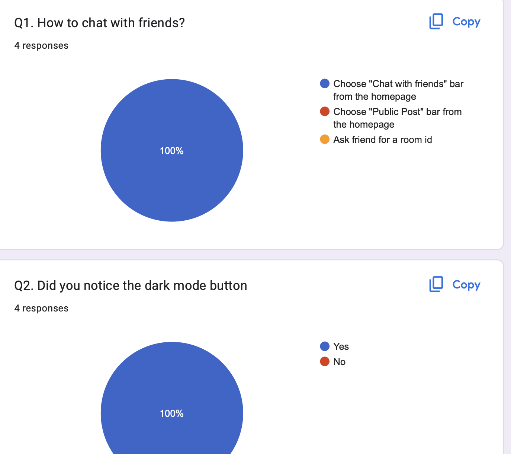
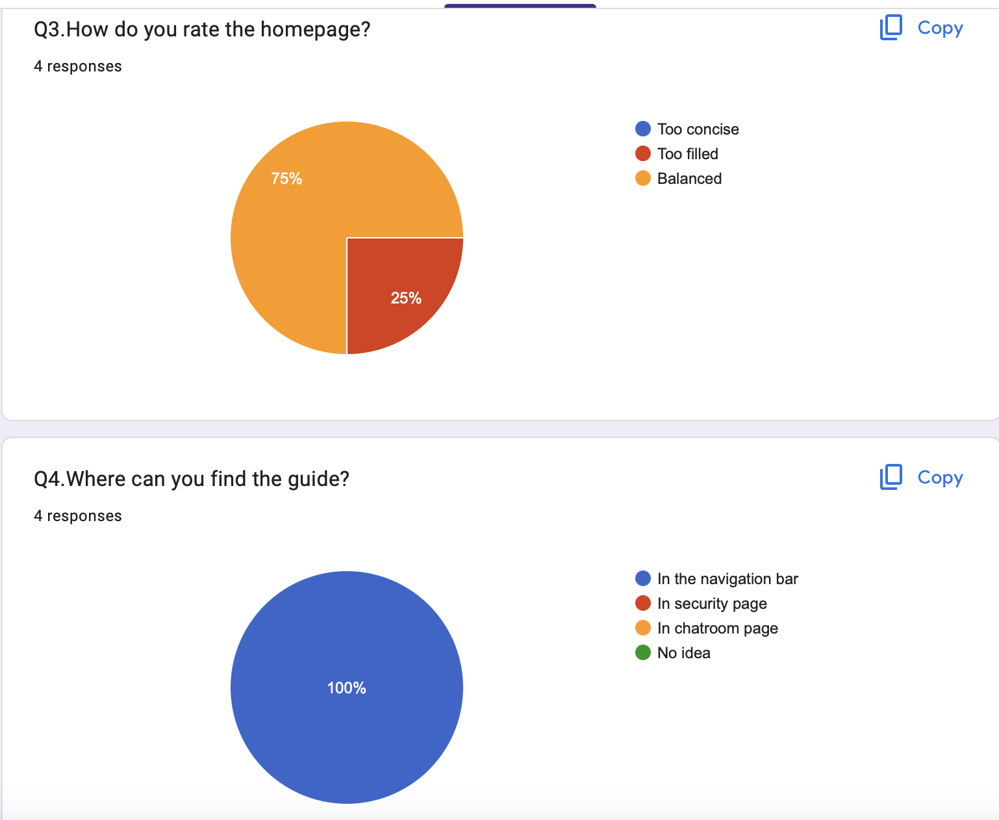
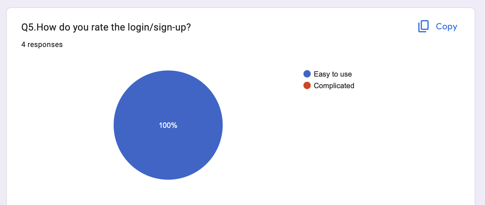

The result of the testing indicates that the wireframe design is generally well-received by users. Participants found the layout intuitive and easy to navigate, with positive feedback on the visual hierarchy and organization of elements. However, some users suggested minor improvements, such as the homepage is too crowded.

## Step 4: Prototype to Real Web Server

### Incremental Development Plan

**Iteration #1: Weeks 9-10**

**Features Completed:**
1. **Multi User Chat Interface**:
   - Developed a real-time chat interface that allows multiple users to communicate simultaneously.
2. **Different permission levels**:
   - Implemented user authentication and authorization to manage user access and permissions.
3. **Knowledge/Public Post**:
   - Added functionality for users to post public.
   - 
**User Testing Results:**
- **Think Aloud Test**: Conducted think aloud testing with five users to gather feedback on the initial features.
- **Feedback**:
  - Positive: Users found the chat interface responsive and easy to use. The permission levels were appreciated for managing user access.
  - Improvements: Users suggested adding a dark mode option and enhancing the post categorization feature.

**Prioritized Features for Iteration #2**:
1. **Anonymous Posting**:
   - Allow users to post messages anonymously in the chat.
2. **Modify and Retrieve Posts**:
   - Enable users to edit and retrieve their posts.
3. **Improve design and aesthetics**:
   - Enhance the visual appeal of the interface with a focus on user experience.

**Iteration #2: Weeks 11-12**

**Features Completed:**
1. **Anonymous Posting**:
   - Implemented the ability for users to post messages anonymously in chatrooms.
2. **Modify and Retrieve Posts**:
   - Added functionality for users to edit and retrieve their posts.
3. **Dark Mode**:
   - Added a toggle option for users to switch between light and dark modes.
4. **Improved Design**:
    - Enhanced the visual aesthetics of the interface based on user feedback.
** User Testing Results:**
- **Think Aloud Test**: Conducted think aloud testing with five users to gather feedback on the new features.
- **Feedback**:
  - Positive: Users appreciated the addition of anonymous posting and the dark mode option.
  - Improvements: Users suggested further enhancements to the post modification feature and additional customization options.
  - Concerns: Some users think current password is too easy to be brute-forced.

### Outline of Evaluations Conducted

**Evaluation Methods:**
1. **Think Aloud Tests**:
   - Users were asked to verbalize their thoughts while interacting with the prototype.
   - Observations were made on user behavior, ease of navigation, and any difficulties encountered.
2. **Performance Metrics**:
   - Monitored the responsiveness and load times of the chat interface during testing.

**Key Findings:**
- **Ease of Use**: Most users found the interface intuitive and easy to navigate.
- **Feature Requests**: Users frequently requested additional customization options and better notification management.
- **Security Concerns**: Users appreciated the added security measures but suggested making the 2FA setup process simpler.

### Future Development Plan
Due to time constraints, some features were not implemented in the current version of the application. Future development plans include:

### Team Collaboration and Contributions

**Team Work Summary**:
- **Collaboration**: The team worked cohesively, leveraging regular meetings and communication tools to stay aligned on goals and progress.

**Self-Evaluation**:
- **Strengths**: Effective communication, clear role assignments, and regular feedback loops.
- **Areas for Improvement**: Need to enhance project management practices to better handle task prioritization and deadlines.

## References
David Lee King. (2021). Social Media Use in 2021. In David Lee King [BLOG]. Newstex.
Moshagen, M., & Thielsch, M. T. (2010). Facets of visual aesthetics. International Journal of Human-Computer Studies, 68(10), 689–709. https://doi.org/10.1016/j.ijhcs.2010.05.006

   
